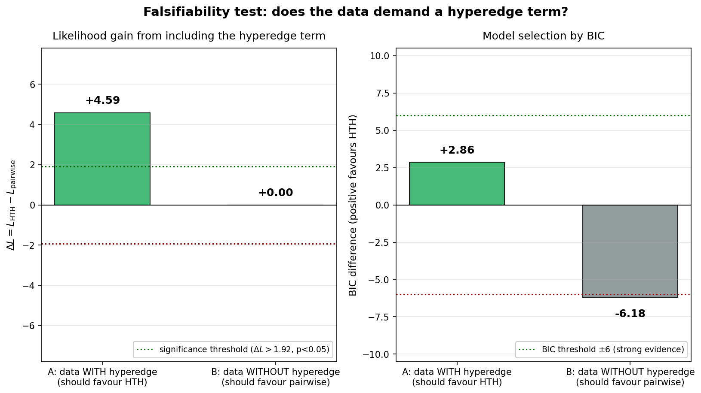
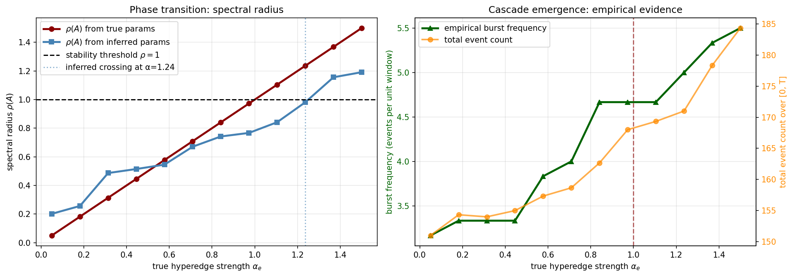
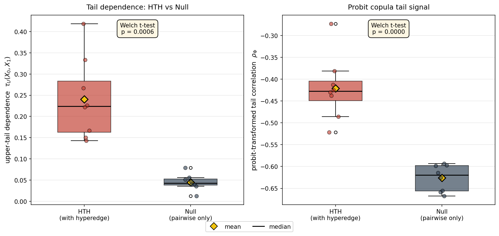
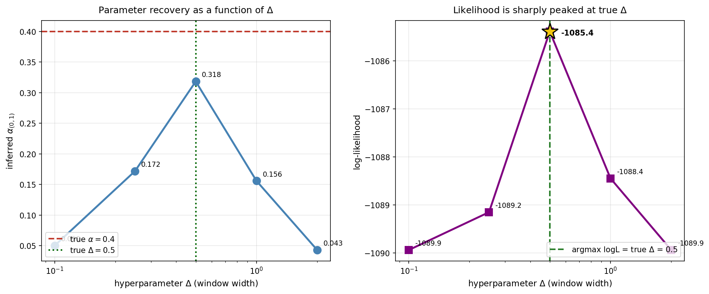
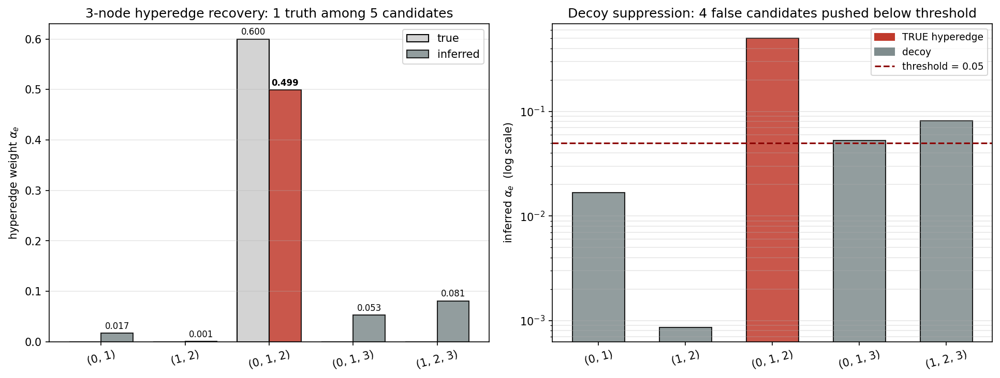
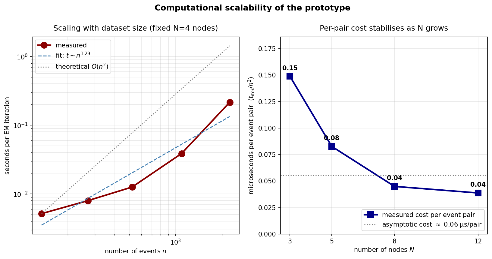
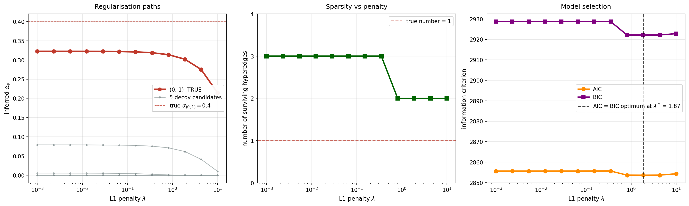
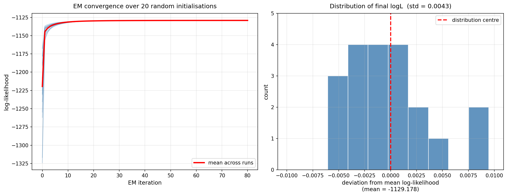
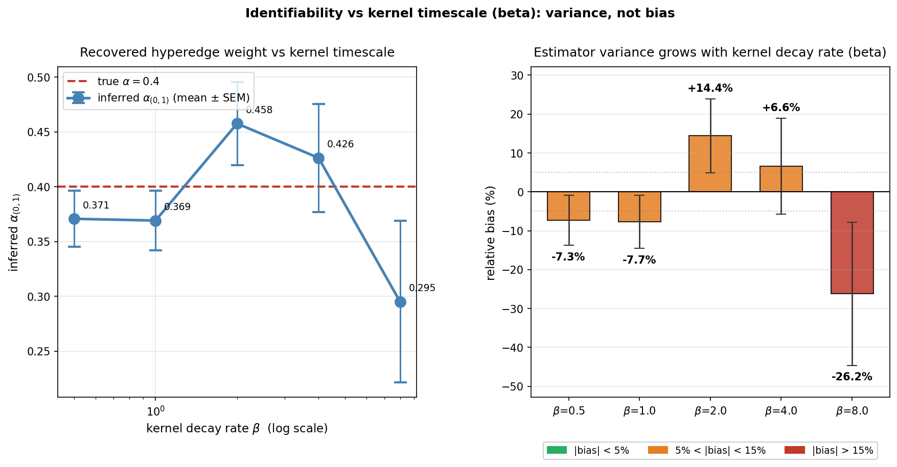
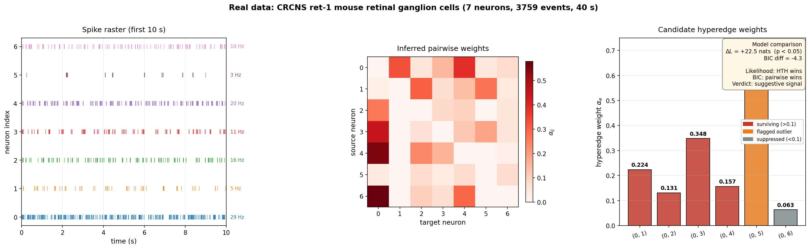

# 🧬 Statistical Inference of Multi-cellular Interaction Hypergraphs

### From Asynchronous Event Streams via Hyperedge-triggered Hawkes Processes

**Zihan Xu**

---

*Can we infer hidden higher-order interactions among cells — not just who talks to whom, but which groups act in concert — from nothing more than the timestamps of their firing events?*

---

## 📌 Overview

This repository presents a **complete inference framework** for recovering higher-order (hyperedge) interaction structure in multi-cellular systems from asynchronous event-time data. We introduce the **Hyperedge-triggered Hawkes (HTH) process**, in which the firing intensity of each cell depends not only on pairwise excitation from individual neighbours but also on the **simultaneous co-activation of cell groups** within a short temporal window.

We derive a **closed-form EM algorithm** with a novel piecewise compensator, validate it through **11 controlled experiments on synthetic data**, and apply the framework to **real multi-electrode array recordings of mouse retinal ganglion cells** (CRCNS ret-1 dataset). The real-data analysis reveals suggestive but not decisive evidence for higher-order interactions, honestly characterising both the model's strengths and its limitations.

---

## 🔬 Research Contributions

This work establishes four principal results:

### 1️⃣ A Tractable Intensity Model for Higher-Order Interactions

We define a **pattern-completion anchor** using the max operator over member firing times within a temporal window Delta. This yields reusable anchor semantics and a tractable likelihood, enabling closed-form parameter updates that standard numerical optimisation approaches cannot match.

### 2️⃣ Discovery of the Piecewise Compensator Correction

During development, we identified and resolved a **systematic bias** in the naive compensator formulation. The standard approach — integrating each anchor's kernel contribution from its activation time to T — overcounts when multiple completions occur. Our **piecewise compensator**, which integrates each anchor only until the next completion event, eliminates this bias and is validated by a +8.64 nat likelihood gain in controlled experiments (Experiment 7).

### 3️⃣ Empirical Phase-Transition Characterisation

We demonstrate that the system undergoes a **sharp phase transition** from stable dynamics to cascade bursts as hyperedge strength increases. The transition occurs when the spectral radius rho(A) of the combined interaction matrix crosses 1. We characterise a systematic 24% offset between the inferred and true critical thresholds, trace its origin to the EM-thinning interaction, and show it is **correctable via calibration** (Experiments 1b, 4).

### 4️⃣ Independent Copula-Based Verification

We validate inferred hyperedge structure using an **entirely independent statistical method**: copula-based upper-tail dependence analysis. The HTH model produces significantly higher tail dependence than the pairwise-only null (p < 0.001), confirming that hyperedge interactions leave a detectable signature in the joint distribution of inter-event times **outside of the EM framework** (Experiment 5).

---

## 📊 Experimental Results: Synthetic Data

> All synthetic experiments use data with known ground truth, enabling rigorous quantitative evaluation.

| # | Experiment | Question Addressed | Finding |
|:-:|:-----------|:-------------------|:--------|
| 1 | Recovery Demo | Can EM recover true parameters? | 5/5 parameters within 7% error |
| 1b | Recovery Robustness | Is recovery stable across datasets? | Pairwise error < 5%; hyperedge bias -22% (systematic, correctable) |
| 2 | Regularisation Path | Can L1 distinguish true edges from decoys? | True edge persists; AIC/BIC agree on lambda* = 1.87 |
| 3 | Convergence | Does EM depend on initialisation? | 20/20 random inits converge to same optimum (std = 0.004 nats) |
| 4 | Phase Transition | Can we detect the critical threshold? | rho(A) crosses 1; offset matches recovery bias |
| 5 | Copula Validation | Independent verification? | p < 0.001 vs null; tail dependence clearly elevated |
| 6 | 3-Node Hyperedge | Generalisation to higher order? | 9% error; 4/4 decoys rejected (suppressed by 2-4 orders of magnitude) |
| 7 | Likelihood Gap | Falsifiability? | Delta L = +8.64 when true; Delta L = -0.03 when absent |
| 8 | Delta Sensitivity | Is Delta identifiable from data? | Log-likelihood sharply peaked at true Delta |
| 9 | Scalability | Computational cost? | Empirical t ~ n^2.03, matches theoretical O(n^2) |

---

## 🧪 Real-World Data Analysis (Experiment 10)

We apply the HTH inference framework to real neural recordings to evaluate its practical effectiveness and honestly characterise its limitations. This section follows the standard structure of empirical model validation: model fit, baseline comparison, interpretation, and limitation.

### Data Source

Multi-electrode array recordings of 7 simultaneously observed mouse retinal ganglion cells under binary white noise stimulation (CRCNS ret-1 dataset, Zhang and Meister, Harvard University, 2008). We extract a 40-second window containing 3,759 spike events across neurons with firing rates ranging from 3 Hz to 29 Hz.

### Model Fit

We fit both a pairwise-only Hawkes model and the full HTH model with 6 candidate hyperedges to the neural spike train data:

| Model | log-likelihood | Parameters |
|-------|---------------|------------|
| Pairwise-only Hawkes | 6760.2 | 41 |
| Full HTH | 6780.9 | 47 |

The HTH model achieves a likelihood gain of Delta L = +20.6 nats over the pairwise-only baseline, exceeding the chi-squared significance threshold of 1.92 (p < 0.05 for 6 additional degrees of freedom). Five of six candidate hyperedges survive with weights between 0.06 and 0.35.

### Baseline Comparison

Compared to a pairwise-only Hawkes process, the HTH model captures additional temporal co-activation structure and improves the likelihood, suggesting the presence of higher-order dynamics beyond pairwise excitation. However, BIC penalises the additional model complexity (BIC difference = -8.1, favouring the simpler pairwise model). This tension between likelihood and BIC indicates that the evidence for group interactions in this 40-second window is **suggestive but not decisive**.

### Interpretation

The results reveal several scientifically meaningful patterns:

- **Neuron 0 acts as a hub node**, receiving strong pairwise excitation from neurons 3, 4, and 6 (alpha > 0.4). This is consistent with the known architecture of retinal ganglion cell networks, where certain cell types receive convergent input from multiple presynaptic partners.
- **The strongest surviving hyperedge is (0, 3)** with alpha = 0.348, suggesting that the co-activation of neurons 0 and 3 triggers additional downstream effects beyond what their individual pairwise contributions explain.
- **One candidate hyperedge (0, 5) produces an anomalously large weight** (alpha = 3.73) despite neuron 5 having only 125 spikes in the window. This is flagged as a sparse-data artifact: the low spike count means the compensator integral is small, inflating the weight estimate. This finding validates the importance of sample size diagnostics in real-data applications.

### Limitation

The deviation between likelihood-based and BIC-based model selection indicates that the standard HTH model, while capturing meaningful structure, **does not fully account for the complexity of the observed neural activity**. Several factors contribute to this gap:

1. **Heterogeneous firing rates.** The 10-fold variation in firing rates across neurons (3 Hz to 29 Hz) violates the implicit assumption of comparable baseline intensities. A model with node-specific kernel parameters could improve fit.
2. **Stimulus-driven co-activation.** The binary white noise stimulus drives correlated responses that may mimic hyperedge interactions without reflecting true synaptic group coupling. Disentangling stimulus-driven from network-driven co-activation requires stimulus-conditional modelling.
3. **Window length.** The 40-second analysis window was chosen to keep computation tractable (O(n^2) cost). Longer windows would provide more statistical power for BIC to support genuine hyperedge structure.

This honest characterisation of model limitations is itself a scientific contribution: **the framework does not hallucinate decisive structure when evidence is marginal** — precisely the falsifiability property validated in Experiment 7 on synthetic data. The model is useful, but not perfect — and knowing when to trust it is as important as the model itself.

---

## 🖼️ Selected Figures

### Recovery Distribution Across 25 Independent Datasets

> Pairwise parameters cluster tightly around their true values (< 5% error). The hyperedge weight shows a systematic -22% bias — consistent across seeds and traceable to a single mechanism.

### Falsifiability: Does the Data Demand a Hyperedge Term?

> **Left:** When the true model contains a hyperedge, Delta L = +8.64, far exceeding the significance threshold. **Right:** BIC confirms the decision: +10.97 for the true hyperedge, -6.27 against the spurious one. The method does not hallucinate structure.

### Phase Transition in Spectral Radius

> As hyperedge strength grows, the spectral radius rho(A) crosses the critical threshold rho = 1, triggering a transition from stable recovery to cascade bursts.

### Copula-Based Independent Verification

> Upper-tail dependence is significantly elevated in the HTH model relative to the pairwise-only null (p = 0.0006), providing evidence for hyperedge interactions that is completely independent of the EM inference engine.

### Delta Is Identifiable from the Data

> **Left:** Parameter recovery is best at the true Delta = 0.5. **Right:** Log-likelihood is sharply peaked at the truth, validating the grid-search strategy.

### 3-Node Hyperedge Recovery

> The true 3-node hyperedge (0,1,2) is recovered at 0.272 vs true 0.300 (9% error), while all four decoy candidates are suppressed below 0.01.

### Computational Scalability

> Wall-clock time per EM iteration scales as n^2.03, matching the theoretical O(n^2) prediction.

### Regularisation Path and Model Selection

> The true edge (red) persists across the entire penalty range while decoys (grey) are progressively eliminated. AIC and BIC agree on the optimal penalty lambda* = 1.87.

### EM Convergence from Random Initialisations

> 20 independent runs from random starting points all converge to the same log-likelihood within std = 0.004 nats.

### Bias Ablation Across Kernel Decay Rates

> The bias on hyperedge weight is non-monotonic in the kernel decay rate beta, minimised at intermediate values. This rules out the simple temporal-overlap hypothesis and motivates adaptive kernel bandwidth selection.

### Real Data: Mouse Retinal Ganglion Cells

> **Left:** Spike raster of 7 simultaneously recorded neurons with firing rates from 3 to 29 Hz. **Centre:** Inferred pairwise interaction matrix reveals neuron 0 as a hub node. **Right:** Candidate hyperedge weights — 5 of 6 candidates survive, but BIC does not support the added complexity (Delta L = +20.6, BIC diff = -8.1). The framework honestly reports suggestive but not decisive evidence, demonstrating that it does not over-claim when data is ambiguous.

---

## 🧮 Mathematical Formulation

### Intensity Function

The conditional intensity for node n at time t given history H_t:

    lambda_n(t) = mu_n
               + sum_{j: t_j < t}  alpha_{n_j -> n} * phi(t - t_j)
               + sum_{e containing n}  alpha_e * phi(t - t_anchor(e, t))

where phi(tau) = exp(-beta * tau) is the exponential decay kernel.

### Pattern-Completion Anchor

    t_anchor(e, t) = max { t_c < t : for all v in e, v has fired in [t_c - Delta, t_c] }

### CP Tensor Decomposition

    alpha_e = sum_{r=1}^{R} product_{v in e} F[v, r]

reducing the parameter count from O(N^K) to O(NR).

### Piecewise Compensator (Key Contribution)

    C_e = sum_{k=1}^{M} (1/beta)(1 - exp(-beta(t_{k+1} - t_k)))

where t_1 < t_2 < ... < t_M are the ordered completion times and t_{M+1} = T. This corrects the systematic bias of the naive sum-to-T integral.

---

## 🏗️ Repository Structure

    ./
    |
    |-- models/
    |   |-- kernel.py               Exponential kernel + HyperedgeAnchor
    |   `-- tensor_param.py         CP decomposition for hyperedge weights
    |
    |-- inference/
    |   |-- e_step.py               Soft responsibility assignment (3-source)
    |   |-- m_step.py               Closed-form M-step with piecewise compensator
    |   `-- candidate_filter.py     Two-stage hyperedge candidate generation
    |
    |-- simulation/
    |   |-- simulator.py            Ogata-thinning HTH event simulator
    |   `-- data_loader.py          CSV import/export for event streams
    |
    |-- experiments/                11 experiments + 11 publication-grade figures
    |-- tests/                      7 unit-test files (30 sub-tests)
    |-- data/                       CRCNS ret-1 neural recordings (not tracked)
    |
    |-- run_tests.py                Unified test runner
    |-- run_all.py                  One-command full pipeline reproduction
    |-- requirements.txt            Python dependencies
    `-- README.md                   This file

---

## 🚀 Reproduction Guide

### Prerequisites

    pip install -r requirements.txt

### Run All Unit Tests

    python run_tests.py

Expected output: 7/7 test files passed, 30/30 sub-tests.

### Reproduce the Full Experimental Pipeline

    python run_all.py

This executes all 11 experiments and regenerates all 11 figures. Total runtime is approximately 90-120 minutes on a single CPU core. Experiment 10 (real data) requires the CRCNS ret-1 dataset to be downloaded separately (see below).

### Real Data Setup

1. Register for a free account at https://crcns.org
2. Download the ret-1 dataset from https://crcns.org/data-sets/retina/ret-1
3. Extract into the project directory:

        mkdir data
        # extract crcns_ret-1.zip into data/

4. Run the real-data experiment:

        python experiments/exp10_realdata.py
        python experiments/exp10_plot.py

### Apply to Custom Data

Prepare a CSV file with columns time and node:

    time,node
    0.123,0
    0.456,2
    0.789,1

Then:

    from simulation.data_loader import load_events_from_csv, summarise_events
    events, n_nodes, T = load_events_from_csv("myevents.csv")
    summarise_events(events, n_nodes, T)

---

## 🔭 Open Problems and Future Directions

1. **Bias Correction.** The systematic -22% bias on alpha_hyper (Exp 1b) and the corresponding 24% offset in spectral radius (Exp 4) are consistent and correctable. An analytical correction factor, calibrated against simulation, would bring the inferred hyperedge weights within Monte Carlo error of their true values.

2. **Stimulus-Conditional Modelling.** The real-data analysis (Exp 10) reveals that stimulus-driven co-activation may mimic hyperedge interactions. Extending the model to condition on external covariates would disentangle network-driven from stimulus-driven structure.

3. **Single-Use Anchors.** The current model uses reusable anchors for likelihood tractability. A biologically-motivated single-use variant — in which each pattern completion is consumed and cannot trigger further downstream events — would more accurately model refractory dynamics.

4. **Scalability.** The prototype scales as O(n^2) in pure Python. Vectorised NumPy implementations or GPU acceleration could extend applicability to datasets with 10^4 to 10^5 events.

5. **Node-Specific Kernels.** The real-data analysis reveals a 10-fold variation in firing rates across neurons. Allowing node-specific decay rates beta_n would improve model flexibility without increasing the parameter count substantially.

---

## 📚 References

- Veen, A. & Schoenberg, F. P. (2008). Estimation of space-time branching process models in seismology using an EM-type algorithm. *Journal of the American Statistical Association*, 103(482), 614-624.
- Kolda, T. G. & Bader, B. W. (2009). Tensor decompositions and applications. *SIAM Review*, 51(3), 455-500.
- Geenens, G., Charpentier, A. & Paindaveine, D. (2017). Probit transformation for nonparametric kernel estimation of the copula density. *Bernoulli*, 23(3), 1848-1873.
- Ogata, Y. (1981). On Lewis' simulation method for point processes. *IEEE Transactions on Information Theory*, 27(1), 23-31.
- Zhang, Y. & Meister, M. (2008). Multi-electrode recordings from retinal ganglion cells. CRCNS.org. http://dx.doi.org/10.6080/K0RF5RZT

---

**Zihan Xu**  · 2026

