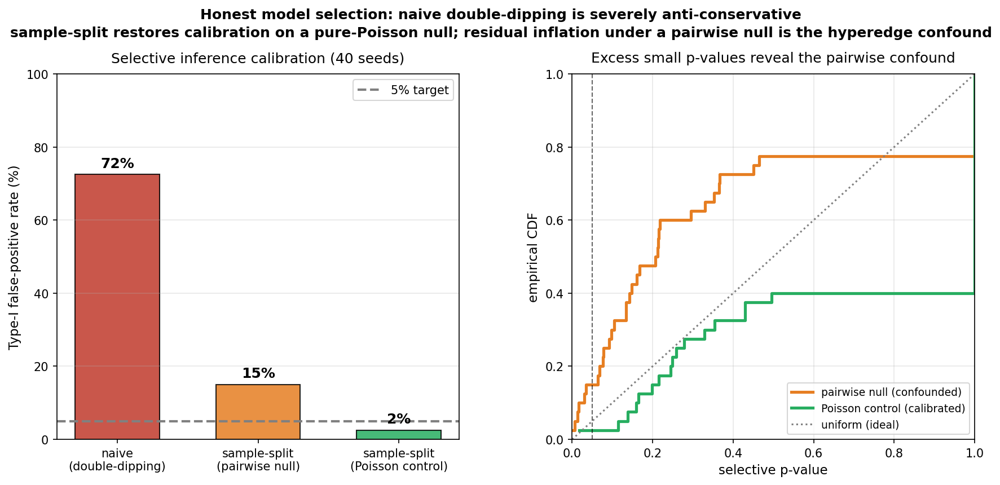
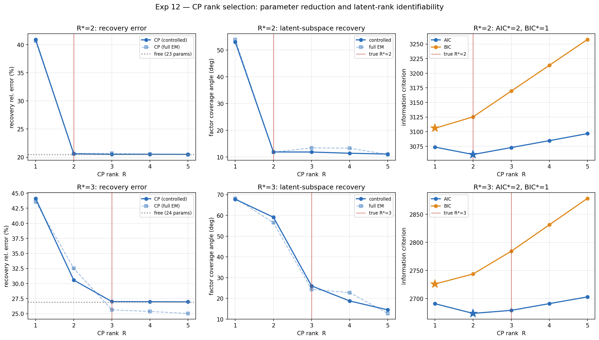

# 🧬 Statistical Inference of Multi-cellular Interaction Hypergraphs

### From Asynchronous Event Streams via Hyperedge-triggered Hawkes Processes

**Zihan Xu**

---

*Can we infer hidden higher-order interactions among cells — not just who talks to whom, but which groups act in concert — from nothing more than the timestamps of their firing events?*

---

## 📌 Overview

This repository presents a **complete inference framework** for recovering higher-order (hyperedge) interaction structure in multi-cellular systems from asynchronous event-time data. We introduce the **Hyperedge-triggered Hawkes (HTH) process**, in which the firing intensity of each cell depends not only on pairwise excitation from individual neighbours but also on the **simultaneous co-activation of cell groups** within a short temporal window.

We derive a **closed-form EM algorithm** with a piecewise compensator, build a **time-rescaling–validated event simulator**, and stress-test the method through a **15-experiment synthetic suite** with known ground truth. Under a correct sampler the maximum-likelihood estimator is **near-unbiased** (hyperedge weight recovered within ~6%); the genuine difficulty is not point-estimate bias but **pairwise↔hyperedge identifiability**. We characterise that limitation honestly — via calibration of a selective-inference procedure, a candidate-generation diagnostic, and a non-trivial interaction baseline — and apply the framework to **real multi-electrode recordings of mouse retinal ganglion cells** (CRCNS ret-1), where the evidence for higher-order interactions is **suggestive but, by BIC, not decisive**.

---

## 🔬 Research Contributions

### 1️⃣ A Tractable Intensity Model for Higher-Order Interactions

We define a **pattern-completion anchor** using the `max` operator over member firing times within a temporal window `Delta`. Combined with an exponential kernel, this yields a tractable likelihood with a **closed-form EM update** for every parameter — baseline rates, pairwise weights, and hyperedge weights — together with a **piecewise compensator** that integrates each anchor only until the next completion event (rather than naively to `T`). Convergence is mode-stable: 20/20 random initialisations reach the same optimum within `std = 0.001` nats (Experiment 3).

### 2️⃣ A Correct, Validated Simulator — and What It Revealed

The HTH event simulator uses **Ogata thinning** in which a single upper bound, recomputed from the post-jump intensity at each accepted event, both generates the candidate inter-arrival **and** serves as the acceptance denominator. This passes the **time-rescaling Kolmogorov–Smirnov test** (rescaled inter-event increments are `Exp(1)`; `p = 0.73` in the discriminating high-intensity regime), and a regression gate (`tests/test_simulator_validity.py`) locks this in.

A key methodological finding: an earlier, non-standard thinning produced an apparent **−22% "systematic bias"** on the hyperedge weight. With the corrected sampler, that bias **largely disappears** — recovery is near-unbiased (**−6.5%** across 25 datasets, Experiment 1b). The lesson, baked into the test suite, is that structural sanity checks (events sorted, in-window) cannot detect an invalid sampler; a distributional check (time-rescaling) is required.

### 3️⃣ Honest Characterisation of the Identifiability Limit

With bias no longer the story, the real limitation is that **pairwise and hyperedge contributions are hard to separate** when coupled nodes co-fire. We quantify this from three angles:

- **Calibration (Experiment 13).** A naive likelihood-ratio test that selects and tests a hyperedge on the same data has a Type-I error of **72%** (target 5%). Sample-splitting + a chi-bar-squared test reduces this to **15%** — better, but still inflated. A **pure-Poisson control** (no pairwise structure) collapses the split FPR to **2%**, isolating the residual as a genuine **pairwise↔hyperedge confound** rather than a general miscalibration.
- **Weak detectability (Experiment 14).** A genuine hyperedge is *nominated* by the candidate pipeline 79–92% of the time and recovered **near-unbiased once found** (−1% to −5%), but it is only clearly *detectable* at higher strength (`dL` rises 0.5 → 2.5 → 5.5 as `alpha` grows 0.4 → 0.6 → 0.8). The bottleneck is detectability, not recall or bias.
- **Inconclusive real data (Experiment 10).** On the retinal recordings, BIC favours the simpler pairwise model; the framework does **not** over-claim.

Fully honest hyperedge inference therefore calls for explicit **component separation** (Bayesian latent-branching / filtered MCMC with simulation-based null calibration) — scoped as future work.

### 4️⃣ Independent Copula-Based Verification

We validate inferred hyperedge structure with an **entirely separate statistical method**: copula-based upper-tail dependence. HTH data exhibit significantly higher upper-tail dependence between member nodes than a pairwise-only null (`tau_U`: 0.167 vs 0.037; Welch `t = 5.80`, **`p = 0.0004`**), confirming that hyperedge interactions leave a detectable signature **outside the EM framework** (Experiment 5).

---

## 📊 Experimental Results: Synthetic Data

> All synthetic experiments use data with known ground truth from the **time-rescaling–validated** simulator, enabling rigorous quantitative evaluation.

| #  | Experiment | Question | Finding |
|:--:|:-----------|:---------|:--------|
| 1  | Recovery Demo | Can EM recover true parameters (single seed)? | 4/5 within ~7%; `a[2→0]` off in one draw (see 1b for the distribution) |
| 1b | Recovery Robustness | Is recovery stable across datasets? | Pairwise errors < 5%; hyperedge weight **near-unbiased, −6.5%** over 25 seeds |
| 2  | Regularisation Path | Can L1 distinguish true edges from decoys? | True edge `(0,1)` persists; AIC **and** BIC optimal at `lambda* = 10.0`, where only the true edge survives |
| 3  | Convergence | Sensitivity to initialisation? | 20/20 random inits → same optimum, `std = 0.001` nats |
| 4  | Strength Sensitivity | How do intensity & inferred coupling respond to hyperedge strength? | Burst frequency rises **smoothly** (no cascade/divergence); `rho` is a reference quantity, **not** a criticality threshold for this non-accumulating model |
| 5  | Copula Validation | Independent verification? | `tau_U` elevated vs null, `p = 0.0004` |
| 6  | 3-Node Hyperedge | Generalisation to order 3? | True `(0,1,2)` recovered **0.499 vs 0.600**; dominant decoys suppressed (two small residual false positives ≈ 0.05–0.08) |
| 7  | Likelihood Gap | Falsifiability? | `dL = +4.59` (BIC +2.86) when present; `dL = 0.00` (BIC −6.18) when absent |
| 8  | Delta Sensitivity | Is `Delta` identifiable? | Log-likelihood peaks at the true `Delta = 0.5` |
| 9  | Scalability | Computational cost? | Empirical `t ~ n^1.95` (asymptote), matching theoretical `O(n^2)` |
| 11 | Bias vs Timescale | Does kernel timescale `beta` drive bias? | Bias **non-monotone** (−7% → +14% → −26%); the systematic effect is on **variance**, not bias |
| 12 | CP Rank Selection | Can we recover the hyperedge-tensor rank? | **AIC + coverage-angle elbow select the true rank** (R\*=2 and R\*=3); BIC under-selects to R=1 |
| 13 | Selective-Inference Calibration | Is hyperedge "discovery" calibrated? | naive FPR **72%**, split **15%**, pure-Poisson control **2%** (target 5%) |
| 14 | Identification Diagnostic | Recall vs identification? | Nomination 79–92%; near-unbiased once found; limited by **detectability** |
| 15 | Interaction Baseline | Does the *mechanism* matter vs a 3-way interaction term? | HTH wins at **every** positive strength, margin grows with strength; neither invents structure on null data |

---

## 🧪 Real-World Data Analysis (Experiment 10)

We apply the HTH framework to real neural recordings to evaluate practical effectiveness and honestly characterise its limits, following the standard structure of empirical model validation.

### Data Source

Multi-electrode array recordings of 7 simultaneously observed mouse retinal ganglion cells under binary white-noise stimulation (CRCNS ret-1, Zhang & Meister, 2008). We analyse a 40-second window containing **3,759 spikes** across neurons firing at 3–29 Hz.

### Model Fit

| Model | log-likelihood | Parameters |
|-------|---------------:|-----------:|
| Pairwise-only Hawkes | 6757.31 | 41 |
| Full HTH (6 candidate hyperedges) | 6779.84 | 47 |

The full-data likelihood gain is `dL = +22.5` nats. **This full-data fit is reported for reference only:** the candidate hyperedges are selected and tested on the same data, so the accompanying likelihood-ratio test is double-dipping and is flagged **invalid** in the output.

### Honest Selective Inference (select on first half, test on held-out half)

Selecting candidates on the first 20 s and testing on the held-out 20 s:

- held-out `dL = +8.10`, chi-bar-squared `p = 2.85e-05`;
- **held-out BIC difference = −28.9** (favours pairwise-only).

### Verdict

The split p-value is a **diagnostic, not calibrated evidence**: retinal data has strong pairwise coupling — exactly the regime where Experiment 13 shows the split false-positive rate is inflated (~15% vs ~5% nominal; ~2% once pairwise structure is removed). **We therefore defer to BIC, which favours the pairwise-only model.** Overall the evidence for group interactions in this window is **suggestive but not decisive**.

### Interpretation & Caveats

- **Neuron 0 acts as a hub**, and every surviving candidate is a pair *containing neuron 0* — consistent with hub-driven pairwise structure being partially re-expressed as hyperedges (the pairwise↔hyperedge confound of Experiments 13–14).
- **Candidate `(0,5)` produces an anomalously large weight** (`alpha = 3.73`) despite neuron 5 having only 125 spikes; flagged as a **sparse-data artifact** (a small compensator inflates the estimate), underscoring the need for sample-size diagnostics.
- **Window length.** 40 s was chosen to keep the `O(n^2)` cost tractable; a longer window would give BIC more power to support (or reject) genuine hyperedge structure.

This honest characterisation is itself a contribution: **the framework does not hallucinate decisive structure when evidence is marginal** — the falsifiability property validated in Experiment 7.

---

## 🖼️ Selected Figures

### Recovery Across 25 Independent Datasets

> Pairwise parameters cluster tightly (< 5% error). Under the corrected simulator the hyperedge weight is **near-unbiased (−6.5%)**; the residual difficulty is identifiability/variance, not a systematic bias.

### Falsifiability: Does the Data Demand a Hyperedge Term?

> When the true model contains a hyperedge, `dL = +4.59` (BIC +2.86). When it does not, `dL = 0.00` (BIC −6.18). The method does not invent structure.

### Interaction-Strength Sensitivity (not a phase transition)

> Burst frequency rises **smoothly** with hyperedge strength — no cascade or divergence. Because the hyperedge uses a single, non-accumulating most-recent anchor, the process does not go super-critical; the `rho = 1` line is a reference, not a criticality threshold.

### Copula-Based Independent Verification

> Upper-tail dependence is significantly elevated in HTH vs the pairwise-only null (`p = 0.0004`), independent of the EM engine.

### Selective-Inference Calibration

> Naive select-and-test: 72% false positives. Sample-split + chi-bar-squared: 15%. Pure-Poisson control: 2% — isolating the residual as a pairwise↔hyperedge confound.

### Delta Is Identifiable from the Data

> Log-likelihood is peaked at the true `Delta = 0.5`, validating the grid-search strategy.

### 3-Node Hyperedge Recovery

> The true 3-node hyperedge `(0,1,2)` is recovered at 0.499 vs true 0.600; dominant decoys are suppressed (two small residual false positives remain — a visible trace of the identifiability limit).

### CP Rank Selection

> AIC and the subspace coverage-angle elbow recover the true hyperedge-tensor rank; BIC is conservative and under-selects.

### Computational Scalability

> Wall-clock time per EM iteration scales as `n^1.95` at large `n`, matching the theoretical `O(n^2)` prediction.

### Real Data: Mouse Retinal Ganglion Cells

> Left: spike raster (7 neurons, 3–29 Hz). Centre: inferred pairwise matrix with neuron 0 as a hub. Right: candidate hyperedge weights — full-data `dL = +22.5`, but held-out **BIC = −28.9** favours pairwise-only. The framework honestly reports suggestive-but-not-decisive evidence.

---

## 🧮 Mathematical Formulation

### Intensity Function

    lambda_n(t) = mu_n
               + sum_{j: t_j < t}  alpha_{n_j -> n} * phi(t - t_j)
               + sum_{e containing n}  alpha_e * phi(t - t_anchor(e, t))

where `phi(tau) = exp(-beta * tau)`.

### Pattern-Completion Anchor

    t_anchor(e, t) = max { t_c < t : for all v in e, v has fired in [t_c - Delta, t_c] }

The most-recent (max) anchor is non-accumulating: a hyperedge contributes at most one decaying bump at a time, which keeps the intensity bounded (no linear-Hawkes-style super-criticality) and makes the compensator closed-form.

### CP Tensor Decomposition

    alpha_e = sum_{r=1}^{R} product_{v in e} F[v, r]

reducing the hyperedge parameter count from `O(N^K)` to `O(NR)`.

### Piecewise Compensator

    C_e = sum_{k=1}^{M} (1/beta)(1 - exp(-beta(t_{k+1} - t_k)))

where `t_1 < ... < t_M` are the ordered completion times and `t_{M+1} = T`. Integrating each anchor only until the next completion (rather than to `T`) gives the exact compensator for the most-recent-anchor intensity.

---

## 🏗️ Repository Structure

    hypergraph_hawkes/
    |
    |-- models/
    |   |-- kernel.py               Exponential kernel + HyperedgeAnchor
    |   |-- tensor_param.py         CP decomposition for hyperedge weights
    |   `-- likelihood.py           Closed-form log-likelihood + piecewise compensator
    |
    |-- inference/
    |   |-- e_step.py               Soft responsibility assignment (3-source)
    |   |-- m_step.py               Closed-form M-step (pairwise + ALS hyperedge)
    |   |-- em.py                   EM driver (hyper_update="als" by default)
    |   `-- candidate_filter.py     Hyperedge candidate generation
    |
    |-- simulation/
    |   |-- simulator.py            Ogata-thinning HTH simulator (time-rescaling validated)
    |   `-- data_loader.py          CSV import/export (explicit observation window T)
    |
    |-- experiments/                Experiments 1-15 + publication figures
    |-- tests/                      Unit tests + test_simulator_validity.py (time-rescaling gate)
    |-- golden/                     Golden-master snapshots (reference values)
    |-- data/                       CRCNS ret-1 recordings (NOT tracked; download separately)
    |
    |-- run_all.py                  One-command full pipeline reproduction
    |-- snapshot_golden.py          Freeze/compare golden-master numbers
    |-- requirements.txt            Python dependencies
    `-- README.md                   This file

---

## 🚀 Reproduction Guide

### Prerequisites

    pip install -r requirements.txt

### Validate the Simulator (recommended first)

    python tests/test_simulator_validity.py
    # Expected: Both time-rescaling gates PASS.

### Reproduce the Full Pipeline

    python run_all.py

Runs the full experiment suite (1–15, including the calibration control and rank sweep) and regenerates all figures. Total runtime is approximately **90–100 minutes** on a single CPU core. Experiment 10 requires the CRCNS ret-1 dataset (see below).

### Freeze / Check Golden Master

    python snapshot_golden.py

### Real Data Setup

1. Register for a free account at https://crcns.org
2. Download the ret-1 dataset from https://crcns.org/data-sets/retina/ret-1
3. Extract into `data/`, then:

        python experiments/exp10_realdata.py
        python experiments/exp10_plot.py

### Apply to Custom Data

Prepare a CSV with columns `time` and `node`:

    time,node
    0.123,0
    0.456,2
    0.789,1

Then (note: the observation window `T` must be passed explicitly — it is **not** inferred from the last event, which would truncate the compensator):

    from simulation.data_loader import load_events_from_csv, summarise_events
    events, n_nodes, T = load_events_from_csv("myevents.csv", T=100.0)
    summarise_events(events, n_nodes, T)

---

## 🔭 Open Problems and Future Directions

1. **Component separation (the core MPhil direction).** The pairwise↔hyperedge identifiability limit — calibration inflation (Exp 13), weak detectability (Exp 14), inconclusive real-data BIC (Exp 10) — is not removable by point-estimation. A Bayesian **latent-branching / filtered-MCMC** treatment that infers per-event source posteriors, with **simulation-based (ABC) null calibration**, would deliver honest hyperedge inference with uncertainty quantification.
2. **Stimulus-conditional modelling.** Stimulus-driven co-activation may mimic hyperedge interactions; conditioning on external covariates would disentangle network-driven from stimulus-driven structure.
3. **Single-use anchors.** A biologically motivated single-use variant (each completion consumed once) would better model refractory dynamics.
4. **Scalability.** The prototype is `O(n^2)` in Python; vectorised/GPU implementations could reach `10^4–10^5` events.
5. **Node-specific kernels.** The 10-fold firing-rate variation in real data motivates node-specific decay rates `beta_n`.

---

## 📚 References

- Veen, A. & Schoenberg, F. P. (2008). Estimation of space-time branching process models in seismology using an EM-type algorithm. *Journal of the American Statistical Association*, 103(482), 614–624.
- Kolda, T. G. & Bader, B. W. (2009). Tensor decompositions and applications. *SIAM Review*, 51(3), 455–500.
- Geenens, G., Charpentier, A. & Paindaveine, D. (2017). Probit transformation for nonparametric kernel estimation of the copula density. *Bernoulli*, 23(3), 1848–1873.
- Ogata, Y. (1981). On Lewis' simulation method for point processes. *IEEE Transactions on Information Theory*, 27(1), 23–31.
- Zhang, Y. & Meister, M. (2008). Multi-electrode recordings from retinal ganglion cells. CRCNS.org. http://dx.doi.org/10.6080/K0RF5RZT

---

**Zihan Xu** · 2026

