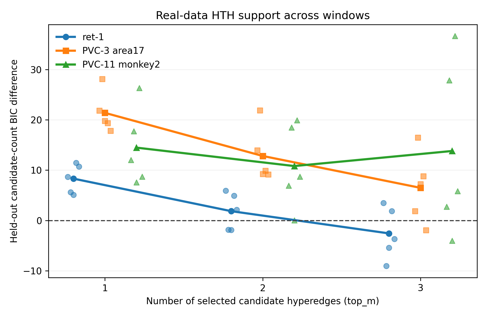
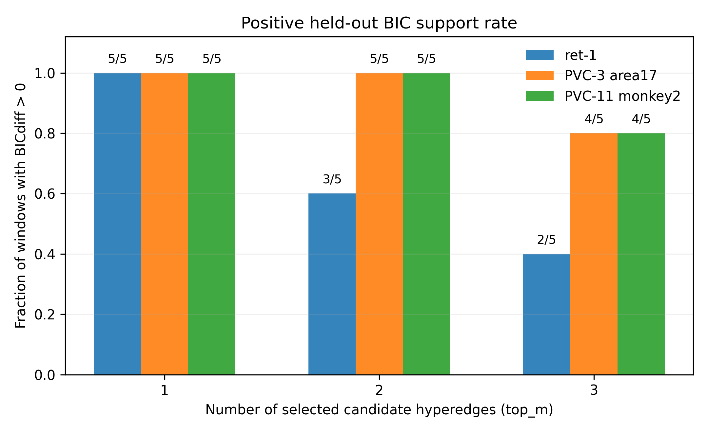
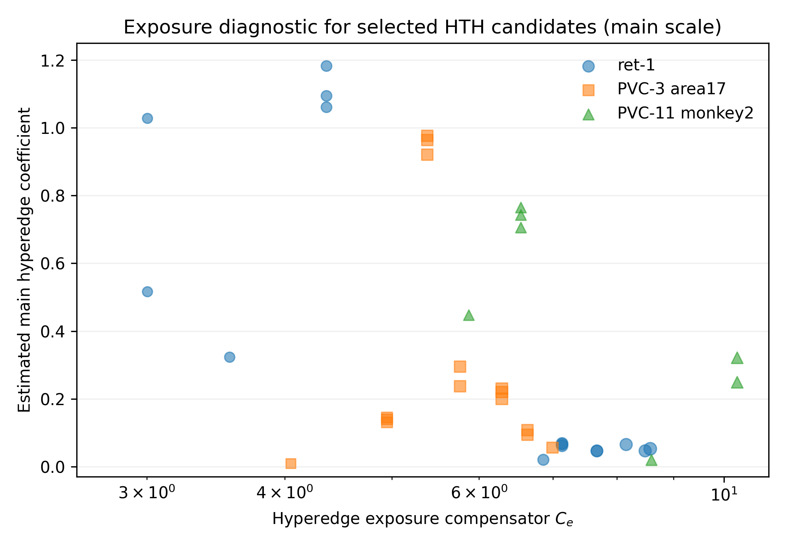

<div align="center">

# 🔥 Hypergraph Hawkes

### Closed-form EM inference for **hyperedge-triggered Hawkes processes**

<p>
  <a href="https://github.com/Hanii0210/hypergraph-hawkes">
    
  </a>
  
  
  
  
  
</p>

<p>
  <a href="#-overview">Overview</a> •
  <a href="#-model">Model</a> •
  <a href="#-figures">Figures</a> •
  <a href="#-experiments">Experiments</a> •
  <a href="#-real-data">Real data</a> •
  <a href="#-quick-start">Quick start</a> •
  <a href="#-repository-layout">Layout</a>
</p>

<br>


<br>

**Higher-order temporal dependence • Hypergraph interactions • EM inference • Point processes**

</div>

---

## 🌟 Overview

**Hypergraph Hawkes** is a research codebase for modeling event streams where **groups of events**, rather than only single past events, can trigger future activity.

Classical multivariate Hawkes processes model pairwise excitation:

> event from node `i` increases the intensity of future events at node `j`.

This project extends that idea to **hyperedge-triggered Hawkes processes (HTH)**:

> a group of source nodes firing within a short activation window can activate an additional higher-order excitation term.

The repository includes:

- 🧠 **Hyperedge-triggered Hawkes models** for higher-order temporal interactions.
- ⚙️ **Closed-form EM-style inference** with latent branching responsibilities.
- 📈 **Synthetic experiments** ordered as `Syn 1`--`Syn 10`.
- 🧪 **Supplementary diagnostics** ordered as `Supp A`--`Supp E`.
- 🧬 **Real-data analyses** on retina and cortical spike-train datasets.
- 🖼️ **Publication-style figures** for model mechanism, synthetic validation, and real-data stability.
- 🧹 A cleaned project structure with separated code, results, figures, and archives.

---

## 🧩 Model

For target node $n$, the conditional intensity is

$$
\lambda_n(t)
=
\mu_n
+
\sum_{j:t_j<t}
\alpha_{n_j \to n}\,\phi(t-t_j)
+
\sum_{e\ni n}
\alpha_e\,\phi(t-t_{\mathrm{anchor}}(e,t)).
$$

where:

| Symbol | Meaning |
|---|---|
| $\mu_n$ | background rate of node $n$ |
| $\alpha_{i\to n}$ | pairwise excitation from node $i$ to node $n$ |
| $e$ | candidate hyperedge |
| $\alpha_e$ | higher-order hyperedge-triggered excitation |
| $\phi(\cdot)$ | temporal kernel |
| $t_{\mathrm{anchor}}(e,t)$ | activation anchor time of the hyperedge pattern |

The real-data model comparison uses **candidate-count BIC** as the primary statistic:

$$
\mathrm{BICdiff}
=
2\left(
\log L_{\mathrm{HTH}}
-
\log L_{\mathrm{pairwise}}
\right)
-
|\mathcal{E}_{\mathrm{cand}}|\log(n_{\mathrm{heldout}}).
$$

Positive values favor HTH after penalizing the number of candidate hyperedges.

> ⚠️ Active-edge-count BIC is printed only as a diagnostic.  
> Formal real-data claims use candidate-count BIC.

---

## 🖼️ Figures

### 🔥 Hyperedge-triggered activation mechanism

<p align="center">
  
</p>

---

### 📊 Real-data BIC stability

<p align="center">
  
</p>

---

### ✅ Positive-window rate

<p align="center">
  
</p>

---

### 🔎 Hyperedge exposure diagnostic

<p align="center">
  
</p>

---

### 🧪 Synthetic examples

<p align="center">
  
</p>

<p align="center">
  
</p>

---

## 🧪 Experiments

The project uses paper-facing experiment names:

- `Syn 1`--`Syn 10`: main synthetic experiments.
- `Supp A`--`Supp E`: supplementary / optional experiments.
- `R1`--`R3`: formal real-data experiments.

See [`experiments/EXPERIMENTS.md`](experiments/EXPERIMENTS.md) for the full inventory.

### 🚀 Main synthetic experiments

| ID | Script | Role |
|---:|---|---|
| Syn 1 | `experiments/syn01_recovery_robustness.py` | parameter recovery and robustness |
| Syn 2 | `experiments/syn02_regularization_path.py` | regularization path and sparsity control |
| Syn 3 | `experiments/syn03_em_convergence.py` | EM convergence from random initializations |
| Syn 4 | `experiments/syn04_strength_sensitivity.py` | interaction-strength sensitivity and non-explosive behavior |
| Syn 5 | `experiments/syn05_likelihood_separation.py` | pairwise confounding and likelihood separation |
| Syn 6 | `experiments/syn06_trigger_window_sensitivity.py` | trigger-window sensitivity |
| Syn 7 | `experiments/syn07_scalability.py` | computational scalability |
| Syn 8 | `experiments/syn08_bias_ablation.py` | kernel-timescale bias / variance ablation |
| Syn 9 | `experiments/syn09_identification_diagnostic.py` | candidate nomination and detectability |
| Syn 10 | `experiments/syn10_interaction_baseline.py` | interaction-baseline comparison |

### 📎 Supplementary experiments

| ID | Script | Role |
|---:|---|---|
| Supp A | `experiments/suppA_recovery_demo.py` | single-seed recovery demo |
| Supp B | `experiments/suppB_copula_validation.py` | copula tail-dependence validation |
| Supp C | `experiments/suppC_3node_hyperedge.py` | minimal 3-node hyperedge example |
| Supp D | `experiments/suppD_rank_sweep.py` | CP-rank sweep |
| Supp E | `experiments/suppE_calibration.py` | calibration / selective-inference diagnostic |

---

## 🧬 Real data

Formal real-data scripts are separated from exploratory legacy scripts.

| ID | Script | Dataset |
|---:|---|---|
| R1 | `experiments/real01_ret1.py` | ret-1 retina |
| R2 | `experiments/real02_pvc3.py` | PVC-3 area 17 |
| R3 | `experiments/real03_pvc11.py` | PVC-11 monkey 2 |

Real-data outputs are stored in:

```text
experiments/results/realdata/
figures/realdata/
```

### 📌 Current real-data summary

| Dataset | top-m | Positive windows | Mean BICdiff | Median BICdiff |
|---|---:|---:|---:|---:|
| ret-1 | 1 | 5/5 | 8.322 | 8.677 |
| ret-1 | 2 | 3/5 | 1.856 | 2.132 |
| ret-1 | 3 | 2/5 | -2.565 | -3.692 |
| PVC-3 area17 | 1 | 5/5 | 21.391 | 19.801 |
| PVC-3 area17 | 2 | 5/5 | 12.822 | 9.887 |
| PVC-3 area17 | 3 | 4/5 | 6.486 | 7.232 |
| PVC-11 monkey2 | 1 | 5/5 | 14.479 | 12.020 |
| PVC-11 monkey2 | 2 | 5/5 | 10.821 | 8.732 |
| PVC-11 monkey2 | 3 | 4/5 | 13.814 | 5.840 |

**Interpretation.** Cortex datasets show more stable HTH evidence across candidate sizes, while ret-1 becomes more fragile as additional candidate pairs are included.

---

## ⚡ Quick start

### 1. Clone

```bash
git clone https://github.com/Hanii0210/hypergraph-hawkes.git
cd hypergraph-hawkes
```

### 2. Install dependencies

```bash
pip install -r requirements.txt
```

### 3. Run tests

```bash
python run_tests.py
```

### 4. Run the quick pipeline

```bash
python run_all.py --quick
```

### 5. Regenerate real-data summary figures

```bash
python experiments/real04_plot_summary.py
```

### 6. Run the BIC smoke check with your own event CSV

```powershell
python experiments\checks\smoke_hth_bic_checked.py `
  --csv path\to\events.csv `
  --T 40.0 `
  --top-m-pairs 1 `
  --n-iter 1
```

Use the actual observation horizon for `--T`.

---

## 🗂️ Repository layout

```text
hypergraph_hawkes/
|-- models/
|   |-- kernel.py
|   |-- likelihood.py
|   `-- tensor_param.py
|-- inference/
|   |-- e_step.py
|   |-- m_step.py
|   |-- em.py
|   `-- candidate_filter.py
|-- simulation/
|   |-- simulator.py
|   `-- data_loader.py
|-- experiments/
|   |-- syn01_*.py ... syn10_*.py
|   |-- suppA_*.py ... suppE_*.py
|   |-- realdata_*.py
|   |-- checks/
|   |-- schematics/
|   |-- results/
|   |   |-- synthetic/
|   |   `-- realdata/
|   `-- EXPERIMENTS.md
|-- figures/
|   |-- synthetic/
|   `-- realdata/
|-- archive/
|   `-- legacy_realdata_scripts/
|-- tests/
|-- run_all.py
|-- run_tests.py
`-- README.md
```

---

## 🧾 Notes

- Raw datasets are **not** included in this repository.
- Large binary artifacts such as `.pkl` and `.npy` are ignored.
- Synthetic figures are stored in `figures/synthetic/`.
- Real-data figures are stored in `figures/realdata/`.
- Formal real-data outputs are stored in `experiments/results/realdata/`.
- Legacy exploratory scripts are archived under `archive/legacy_realdata_scripts/`.

---

## 📚 Citation

This repository is a research prototype.  
If you use or adapt the code, please cite the repository URL and the associated manuscript when available.

---

<div align="center">

### 🔥 Hyperedge-triggered event modeling for higher-order temporal dependence

</div>
