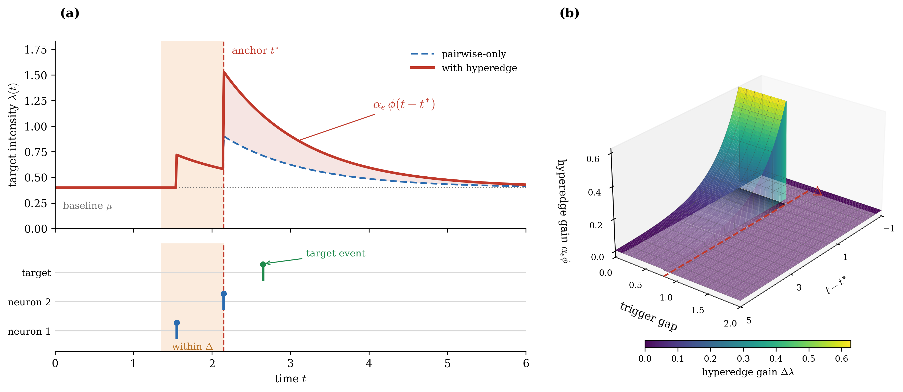
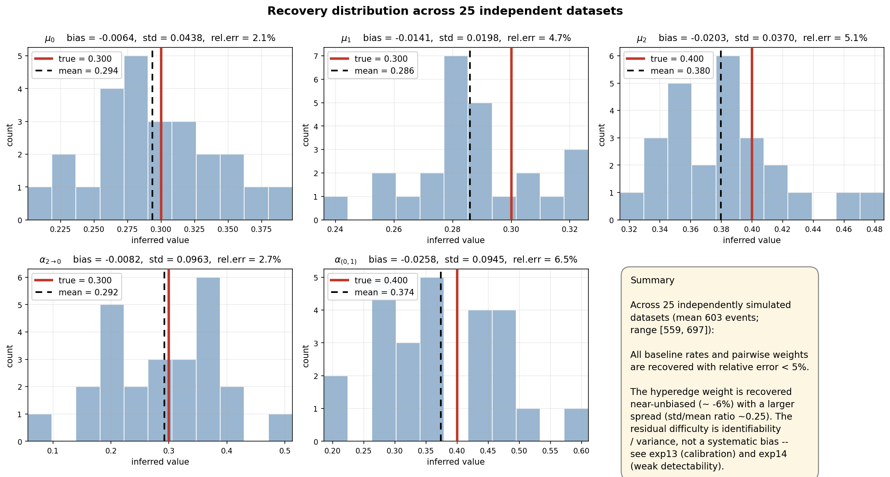
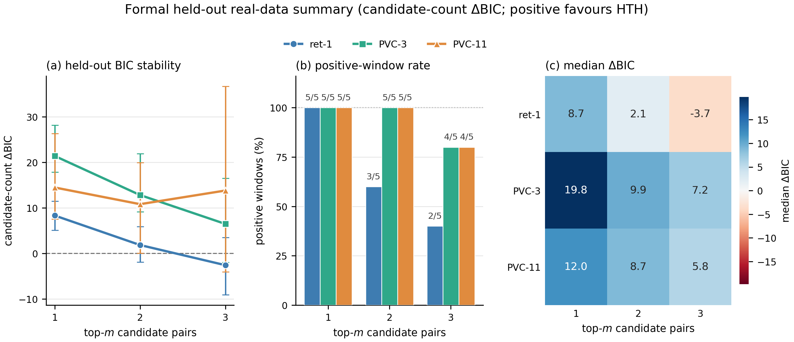

<div align="center">

# 🔥 Hypergraph Hawkes

### Closed-form EM inference for **hyperedge-triggered Hawkes processes**

<p>
  <a href="https://github.com/Hanii0210/hypergraph-hawkes">
    
  </a>
  
  
  
  
  
</p>

<p>
  <a href="#-overview">Overview</a> •
  <a href="#-model">Model</a> •
  <a href="#-experiments">Experiments</a> •
  <a href="#-data-sources">Data sources</a> •
  <a href="#-synthetic-highlights">Synthetic</a> •
  <a href="#-real-data">Real data</a> •
  <a href="#-quick-start">Quick start</a>
</p>

<br>

<p align="center">
  <strong>Can higher-order event patterns be separated from ordinary pairwise excitation?</strong><br>
  This repository studies hyperedge-triggered Hawkes processes as a lightweight way to detect group-level temporal interactions in event streams.
</p>

<br>



<br>

**Higher-order temporal dependence · Hypergraph interactions · EM inference · Point processes**

</div>

---

## 🌟 Overview

**Hypergraph Hawkes** is a research codebase for modeling event streams where **groups of past events**, rather than only individual past events, can trigger future activity.

Classical multivariate Hawkes processes model pairwise excitation:

> an event from node `i` increases the future intensity of node `j`.

This project extends that idea to **hyperedge-triggered Hawkes processes (HTH)**:

> a group of source nodes firing within a short activation window can activate an additional higher-order excitation term.

The repository contains:

- 🧠 hyperedge-triggered Hawkes models for higher-order temporal interactions;
- ⚙️ closed-form EM-style inference with latent branching responsibilities;
- 📈 synthetic experiments ordered as `Syn 01`--`Syn 10`;
- 🧪 supplementary diagnostics ordered as `Supp A`--`Supp E`;
- 🧬 formal real-data scripts ordered as `Real 01`--`Real 04`;
- 🖼️ publication-style figures for model intuition, synthetic validation, and real-data stability.

---

## 🧩 Model

For target node `n`, the conditional intensity is:

```math
\lambda_n(t)
=
\mu_n
+
\sum_{j:t_j<t}
\alpha_{n_j\to n}\,\phi(t-t_j)
+
\sum_{e\ni n}
\alpha_e\,\phi\!\left(t-t_{\mathrm{anchor}}(e,t)\right)
```

where:

| Symbol | Meaning |
|---|---|
| `μ_n` | background rate of node `n` |
| `α_{i→n}` | pairwise excitation from node `i` to node `n` |
| `e` | candidate hyperedge |
| `α_e` | higher-order hyperedge-triggered excitation |
| `φ(·)` | temporal kernel |
| `t_anchor(e,t)` | activation anchor time of the hyperedge pattern |

The primary real-data model-comparison statistic is candidate-count BIC:

```math
\Delta \mathrm{BIC}_{\mathrm{cand}}
=
2\left(
\log L_{\mathrm{HTH}}
-
\log L_{\mathrm{pairwise}}
\right)
-
|\mathcal{E}_{\mathrm{cand}}|\log(n_{\mathrm{heldout}})
```

Positive values favor the HTH model after penalizing the number of candidate hyperedges.

> ⚠️ Active-edge-count BIC is used only as a diagnostic.  
> Formal real-data claims use candidate-count BIC.

---

## 🧪 Experiments

The project uses paper-facing experiment names.

### 🚀 Main synthetic experiments

| ID | Script | Role |
|---:|---|---|
| Syn 01 | `experiments/syn01_recovery_robustness.py` | parameter recovery and robustness |
| Syn 02 | `experiments/syn02_regularization_path.py` | regularization path and sparsity control |
| Syn 03 | `experiments/syn03_em_convergence.py` | EM convergence from random initializations |
| Syn 04 | `experiments/syn04_strength_sensitivity.py` | interaction-strength sensitivity |
| Syn 05 | `experiments/syn05_likelihood_separation.py` | pairwise confounding and likelihood separation |
| Syn 06 | `experiments/syn06_trigger_window_sensitivity.py` | trigger-window sensitivity |
| Syn 07 | `experiments/syn07_scalability.py` | computational scalability |
| Syn 08 | `experiments/syn08_bias_ablation.py` | kernel-timescale bias / variance ablation |
| Syn 09 | `experiments/syn09_identification_diagnostic.py` | candidate nomination and detectability |
| Syn 10 | `experiments/syn10_interaction_baseline.py` | interaction-baseline comparison |

### 📎 Supplementary experiments

| ID | Script | Role |
|---:|---|---|
| Supp A | `experiments/suppA_recovery_demo.py` | single-seed recovery demo |
| Supp B | `experiments/suppB_copula_validation.py` | copula tail-dependence validation |
| Supp C | `experiments/suppC_3node_hyperedge.py` | minimal 3-node hyperedge example |
| Supp D | `experiments/suppD_rank_sweep.py` | CP-rank sweep |
| Supp E | `experiments/suppE_calibration.py` | calibration / selective-inference diagnostic |

### 🧬 Formal real-data experiments

| ID | Script | Dataset / role |
|---:|---|---|
| Real 01 | `experiments/real01_ret1.py` | ret-1 retina |
| Real 02 | `experiments/real02_pvc3.py` | PVC-3 area 17 |
| Real 03 | `experiments/real03_pvc11.py` | PVC-11 monkey 2 |
| Real 04 | `experiments/real04_plot_summary.py` | real-data summary panel |

See [`experiments/EXPERIMENTS.md`](experiments/EXPERIMENTS.md) for the complete inventory.

---

## 🗃️ Data sources

Raw datasets are **not included** in this repository. The project expects local data under `data/raw/`, which is ignored by Git.

The formal real-data analysis uses three spike-train datasets:

| ID | Dataset | Current role |
|---:|---|---|
| R1 | ret-1 retina | formal held-out HTH comparison |
| R2 | PVC-3 area 17 | formal held-out HTH comparison |
| R3 | PVC-11 monkey 2 | formal held-out HTH comparison |

### G-Node exploratory data

The repository also keeps a legacy G-Node-style exploratory path for a binned pseudo-event dataset. This is useful as a smoke-test / development example, but it is **not** used as formal evidence for HTH effects in the current paper-facing analysis.

In short:

- G-Node-style data were used for early exploratory checks;
- the binned pseudo-event representation is treated cautiously;
- formal claims are based on `Real 01`--`Real 03`;
- legacy G-Node-related scripts are kept under `archive/legacy_realdata_scripts/`.

---

## 📈 Synthetic highlights

### Syn 01 — recovery and robustness

<p align="center">
  
</p>

### Syn 05 — likelihood separation

<p align="center">
  
</p>

### Syn 08 — bias ablation

<p align="center">
  
</p>

---

## 🧬 Real data

Formal real-data analysis is summarized through candidate-count BIC on held-out windows.

<p align="center">
  
</p>

### 📌 Current real-data summary

| Dataset | top-m | Positive windows | Mean ΔBIC | Median ΔBIC |
|---|---:|---:|---:|---:|
| ret-1 | 1 | 5/5 | 8.322 | 8.677 |
| ret-1 | 2 | 3/5 | 1.856 | 2.132 |
| ret-1 | 3 | 2/5 | -2.565 | -3.692 |
| PVC-3 area17 | 1 | 5/5 | 21.391 | 19.801 |
| PVC-3 area17 | 2 | 5/5 | 12.822 | 9.887 |
| PVC-3 area17 | 3 | 4/5 | 6.486 | 7.232 |
| PVC-11 monkey2 | 1 | 5/5 | 14.479 | 12.020 |
| PVC-11 monkey2 | 2 | 5/5 | 10.821 | 8.732 |
| PVC-11 monkey2 | 3 | 4/5 | 13.814 | 5.840 |

**Interpretation.** The cortex datasets show more stable HTH evidence across candidate sizes, while ret-1 becomes more fragile as additional candidate pairs are included.

---

## ⚡ Quick start

### 1. Clone

```bash
git clone https://github.com/Hanii0210/hypergraph-hawkes.git
cd hypergraph-hawkes
```

### 2. Install dependencies

```bash
pip install -r requirements.txt
```

### 3. Run tests

```bash
python run_tests.py
```

### 4. Run the quick pipeline

```bash
python run_all.py --quick
```

### 5. Regenerate the real-data summary panel

```bash
python experiments/real04_plot_summary.py
```

### 6. Run the BIC smoke check with your own event CSV

```powershell
python experiments\checks\smoke_hth_bic_checked.py `
  --csv path\to\events.csv `
  --T 40.0 `
  --top-m-pairs 1 `
  --n-iter 1
```

Use the actual observation horizon for `--T`.

---

## 🗂️ Repository layout

```text
hypergraph_hawkes/
|-- models/
|   |-- kernel.py
|   |-- likelihood.py
|   `-- tensor_param.py
|-- inference/
|   |-- e_step.py
|   |-- m_step.py
|   |-- em.py
|   `-- candidate_filter.py
|-- simulation/
|   |-- simulator.py
|   `-- data_loader.py
|-- experiments/
|   |-- syn01_*.py ... syn10_*.py
|   |-- suppA_*.py ... suppE_*.py
|   |-- real01_ret1.py
|   |-- real02_pvc3.py
|   |-- real03_pvc11.py
|   |-- real04_plot_summary.py
|   |-- realdata_pipeline.py
|   |-- checks/
|   |-- schematics/
|   |-- results/
|   |   |-- synthetic/
|   |   `-- realdata/
|   `-- EXPERIMENTS.md
|-- figures/
|   |-- synthetic/
|   `-- realdata/
|-- archive/
|   `-- legacy_realdata_scripts/
|-- tests/
|-- run_all.py
|-- run_tests.py
`-- README.md
```

---

## 🧾 Notes

- Raw datasets are **not** included in this repository.
- Large binary artifacts such as `.pkl` and `.npy` are ignored.
- Formal real-data outputs are stored in `experiments/results/realdata/`.
- Synthetic figures are stored in `figures/synthetic/`.
- The real-data summary panel is stored at `figures/realdata/real04_summary_panel.png`.
- Legacy exploratory scripts are archived under `archive/legacy_realdata_scripts/`.

---

## 📚 Citation

This repository is a research prototype.  
If you use or adapt the code, please cite the repository URL and the associated manuscript when available.

---

<div align="center">

### 🔥 Hyperedge-triggered event modeling for higher-order temporal dependence

</div>
